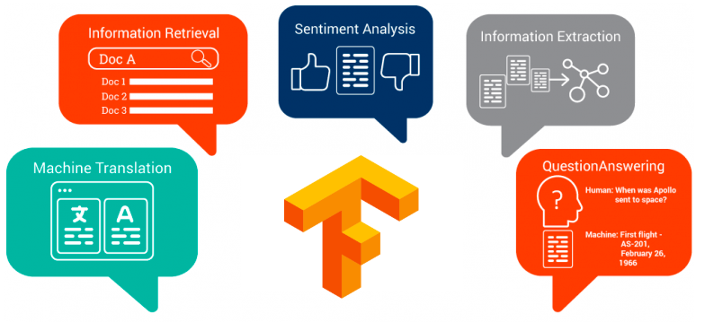

<p align="center">
    <a href="#readme">
        
    </a>
</p>
<p align="center">
  <a href="https://github.com/huseinzol05/NLP-Models-Tensorflow/blob/master/LICENSE"></a>
  <a href="#"></a>
</p>

---

**NLP-Models-Tensorflow**, Gathers machine learning and tensorflow deep learning models for NLP problems, **code simplify inside Jupyter Notebooks 100%**.

## Table of contents
  * [Abstractive Summarization](#abstractive-summarization)
  * [Chatbot](#chatbot)
  * [Dependency Parser](#dependency-parser)
  * [Entity Tagging](#entity-tagging)
  * [Extractive Summarization](#extractive-summarization)
  * [Generator](#generator)
  * [Language Detection](#language-detection)
  * [Neural Machine Translation](neural-machine-translation)
  * [OCR](#ocr-optical-character-recognition)
  * [POS Tagging](#pos-tagging)
  * [Question-Answers](#question-answers)
  * [Sentence pairs](#sentence-pair)
  * [Speech-to-Text](#speech-to-text)
  * [Spelling correction](#spelling-correction)
  * [SQUAD Question-Answers](#squad-question-answers)
  * [Stemming](#stemming)
  * [Text Augmentation](#text-augmentation)
  * [Text Classification](#text-classification)
  * [Text Similarity](#text-similarity)
  * [Text-to-Speech](#text-to-speech)
  * [Topic Generator](#topic-generator)
  * [Topic Modeling](#topic-modeling)
  * [Unsupervised Extractive Summarization](#unsupervised-extractive-summarization)
  * [Vectorizer](#vectorizer)
  * [Old-to-Young Vocoder](#old-to-young-vocoder)
  * [Visualization](#visualization)
  * [Attention](#attention)

## Objective

Original implementations are quite complex and not really beginner friendly. So I tried to simplify most of it. Also, there are tons of not-yet release papers implementation. So feel free to use it for your own research!

I will attached github repositories for models that I not implemented from scratch, basically I copy, paste and fix those code for deprecated issues.

## Tensorflow version

Tensorflow version 1.13 and above only, not included 2.X version. 1.13 < Tensorflow < 2.0 

```bash
pip install -r requirements.txt
```

## Contents

### [Abstractive Summarization](abstractive-summarization)

Trained on [India news](abstractive-summarization/dataset).

Accuracy based on 10 epochs only, calculated using word positions.

<details><summary>Complete list (12 notebooks)</summary>

1. LSTM Seq2Seq using topic modelling, test accuracy 13.22%
2. LSTM Seq2Seq + Luong Attention using topic modelling, test accuracy 12.39%
3. LSTM Seq2Seq + Beam Decoder using topic modelling, test accuracy 10.67%
4. LSTM Bidirectional + Luong Attention + Beam Decoder using topic modelling, test accuracy 8.29%
5. Pointer-Generator + Bahdanau, https://github.com/xueyouluo/my_seq2seq, test accuracy 15.51%
6. Copynet, test accuracy 11.15%
7. Pointer-Generator + Luong, https://github.com/xueyouluo/my_seq2seq, test accuracy 16.51%
8. Dilated Seq2Seq, test accuracy 10.88%
9. Dilated Seq2Seq + Self Attention, test accuracy 11.54%
10. BERT + Dilated CNN Seq2seq, test accuracy 13.5%
11. self-attention + Pointer-Generator, test accuracy 4.34%
12. Dilated-CNN Seq2seq + Pointer-Generator, test accuracy 5.57%

</details>

### [Chatbot](chatbot)

Trained on [Cornell Movie Dialog corpus](chatbot/dataset.tar.gz), accuracy table in [chatbot](chatbot).

<details><summary>Complete list (54 notebooks)</summary>

1. Basic cell Seq2Seq-manual
2. LSTM Seq2Seq-manual
3. GRU Seq2Seq-manual
4. Basic cell Seq2Seq-API Greedy
5. LSTM Seq2Seq-API Greedy
6. GRU Seq2Seq-API Greedy
7. Basic cell Bidirectional Seq2Seq-manual
8. LSTM Bidirectional Seq2Seq-manual
9. GRU Bidirectional Seq2Seq-manual
10. Basic cell Bidirectional Seq2Seq-API Greedy
11. LSTM Bidirectional Seq2Seq-API Greedy
12. GRU Bidirectional Seq2Seq-API Greedy
13. Basic cell Seq2Seq-manual + Luong Attention
14. LSTM Seq2Seq-manual + Luong Attention
15. GRU Seq2Seq-manual + Luong Attention
16. Basic cell Seq2Seq-manual + Bahdanau Attention
17. LSTM Seq2Seq-manual + Bahdanau Attention
18. GRU Seq2Seq-manual + Bahdanau Attention
19. LSTM Bidirectional Seq2Seq-manual + Luong Attention
20. GRU Bidirectional Seq2Seq-manual + Luong Attention
21. LSTM Bidirectional Seq2Seq-manual + Bahdanau Attention
22. GRU Bidirectional Seq2Seq-manual + Bahdanau Attention
23. LSTM Bidirectional Seq2Seq-manual + backward Bahdanau + forward Luong
24. GRU Bidirectional Seq2Seq-manual + backward Bahdanau + forward Luong
25. LSTM Seq2Seq-API Greedy + Luong Attention
26. GRU Seq2Seq-API Greedy + Luong Attention
27. LSTM Seq2Seq-API Greedy + Bahdanau Attention
28. GRU Seq2Seq-API Greedy + Bahdanau Attention
29. LSTM Seq2Seq-API Beam Decoder
30. GRU Seq2Seq-API Beam Decoder
31. LSTM Bidirectional Seq2Seq-API + Luong Attention + Beam Decoder
32. GRU Bidirectional Seq2Seq-API + Luong Attention + Beam Decoder
33. LSTM Bidirectional Seq2Seq-API + backward Bahdanau + forward Luong + Stack Bahdanau Luong Attention + Beam Decoder
34. GRU Bidirectional Seq2Seq-API + backward Bahdanau + forward Luong + Stack Bahdanau Luong Attention + Beam Decoder
35. Bytenet
36. LSTM Seq2Seq + tf.estimator
37. Capsule layers + LSTM Seq2Seq-API Greedy
38. Capsule layers + LSTM Seq2Seq-API + Luong Attention + Beam Decoder
39. LSTM Bidirectional Seq2Seq-API + backward Bahdanau + forward Luong + Stack Bahdanau Luong Attention + Beam Decoder + Dropout + L2
40. DNC Seq2Seq
41. LSTM Bidirectional Seq2Seq-API + Luong Monotic Attention + Beam Decoder
42. LSTM Bidirectional Seq2Seq-API + Bahdanau Monotic Attention + Beam Decoder
43. End-to-End Memory Network + Basic cell
44. End-to-End Memory Network + LSTM cell
45. Attention is all you need
46. Transformer-XL
47. Attention is all you need + Beam Search
48. Transformer-XL + LSTM
49. GPT-2 + LSTM
50. CNN Seq2seq
51. Conv-Encoder + LSTM
52. Tacotron + Greedy decoder
53. Tacotron + Beam decoder
54. Google NMT

</details>

### [Dependency-Parser](dependency-parser)

Trained on [CONLL English Dependency](https://github.com/UniversalDependencies/UD_English-EWT). Train set to train, dev and test sets to test.

Stackpointer and Biaffine-attention originally from https://github.com/XuezheMax/NeuroNLP2 written in Pytorch.

Accuracy based on arc, types and root accuracies after 15 epochs only.

<details><summary>Complete list (8 notebooks)</summary>

1. Bidirectional RNN + CRF + Biaffine, arc accuracy 70.48%, types accuracy 65.18%, root accuracy 66.4%
2. Bidirectional RNN + Bahdanau + CRF + Biaffine, arc accuracy 70.82%, types accuracy 65.33%, root accuracy 66.77%
3. Bidirectional RNN + Luong + CRF + Biaffine, arc accuracy 71.22%, types accuracy 65.73%, root accuracy 67.23%
4. BERT Base + CRF + Biaffine, arc accuracy 64.30%, types accuracy 62.89%, root accuracy 74.19%
5. Bidirectional RNN + Biaffine Attention + Cross Entropy, arc accuracy 72.42%, types accuracy 63.53%, root accuracy 68.51%
6. BERT Base + Biaffine Attention + Cross Entropy, arc accuracy 72.85%, types accuracy 67.11%, root accuracy 73.93%
7. Bidirectional RNN + Stackpointer, arc accuracy 61.88%, types accuracy 48.20%, root accuracy 89.39%
8. XLNET Base + Biaffine Attention + Cross Entropy, arc accuracy 74.41%, types accuracy 71.37%, root accuracy 73.17%

</details>

### [Entity-Tagging](entity-tagging)

Trained on [CONLL NER](https://cogcomp.org/page/resource_view/81).

<details><summary>Complete list (9 notebooks)</summary>

1. Bidirectional RNN + CRF, test accuracy 96%
2. Bidirectional RNN + Luong Attention + CRF, test accuracy 93%
3. Bidirectional RNN + Bahdanau Attention + CRF, test accuracy 95%
4. Char Ngrams + Bidirectional RNN + Bahdanau Attention + CRF, test accuracy 96%
5. Char Ngrams + Bidirectional RNN + Bahdanau Attention + CRF, test accuracy 96%
6. Char Ngrams + Residual Network + Bahdanau Attention + CRF, test accuracy 69%
7. Char Ngrams + Attention is you all Need + CRF, test accuracy 90%
8. BERT, test accuracy 99%
9. XLNET-Base, test accuracy 99%

</details>

### [Extractive Summarization](extractive-summarization)

Trained on [CNN News dataset](https://cs.nyu.edu/~kcho/DMQA/).

Accuracy based on ROUGE-2.

<details><summary>Complete list (4 notebooks)</summary>

1. LSTM RNN, test accuracy 16.13%
2. Dilated-CNN, test accuracy 15.54%
3. Multihead Attention, test accuracy 26.33%
4. BERT-Base

</details>

### [Generator](generator)

Trained on [Shakespeare dataset](generator/shakespeare.txt).

<details><summary>Complete list (15 notebooks)</summary>

1. Character-wise RNN + LSTM
2. Character-wise RNN + Beam search
3. Character-wise RNN + LSTM + Embedding
4. Word-wise RNN + LSTM
5. Word-wise RNN + LSTM + Embedding
6. Character-wise + Seq2Seq + GRU
7. Word-wise + Seq2Seq + GRU
8. Character-wise RNN + LSTM + Bahdanau Attention
9. Character-wise RNN + LSTM + Luong Attention
10. Word-wise + Seq2Seq + GRU + Beam
11. Character-wise + Seq2Seq + GRU + Bahdanau Attention
12. Word-wise + Seq2Seq + GRU + Bahdanau Attention
13. Character-wise Dilated CNN + Beam search
14. Transformer + Beam search
15. Transformer XL + Beam search

</details>

### [Language-detection](language-detection)

Trained on [Tatoeba dataset](http://downloads.tatoeba.org/exports/sentences.tar.bz2).

<details><summary>Complete list (1 notebooks)</summary>

1. Fast-text Char N-Grams

</details>

### [Neural Machine Translation](neural-machine-translation)

Trained on [English-French](https://github.com/tensorflow/tensor2tensor/blob/master/tensor2tensor/data_generators/translate_enfr.py), accuracy table in [neural-machine-translation](neural-machine-translation).

<details><summary>Complete list (53 notebooks)</summary>

1.basic-seq2seq
2.lstm-seq2seq
3.gru-seq2seq
4.basic-seq2seq-contrib-greedy
5.lstm-seq2seq-contrib-greedy
6.gru-seq2seq-contrib-greedy
7.basic-birnn-seq2seq
8.lstm-birnn-seq2seq
9.gru-birnn-seq2seq
10.basic-birnn-seq2seq-contrib-greedy
11.lstm-birnn-seq2seq-contrib-greedy
12.gru-birnn-seq2seq-contrib-greedy
13.basic-seq2seq-luong
14.lstm-seq2seq-luong
15.gru-seq2seq-luong
16.basic-seq2seq-bahdanau
17.lstm-seq2seq-bahdanau
18.gru-seq2seq-bahdanau
19.basic-birnn-seq2seq-bahdanau
20.lstm-birnn-seq2seq-bahdanau
21.gru-birnn-seq2seq-bahdanau
22.basic-birnn-seq2seq-luong
23.lstm-birnn-seq2seq-luong
24.gru-birnn-seq2seq-luong
25.lstm-seq2seq-contrib-greedy-luong
26.gru-seq2seq-contrib-greedy-luong
27.lstm-seq2seq-contrib-greedy-bahdanau
28.gru-seq2seq-contrib-greedy-bahdanau
29.lstm-seq2seq-contrib-beam-luong
30.gru-seq2seq-contrib-beam-luong
31.lstm-seq2seq-contrib-beam-bahdanau
32.gru-seq2seq-contrib-beam-bahdanau
33.lstm-birnn-seq2seq-contrib-beam-bahdanau
34.lstm-birnn-seq2seq-contrib-beam-luong
35.gru-birnn-seq2seq-contrib-beam-bahdanau
36.gru-birnn-seq2seq-contrib-beam-luong
37.lstm-birnn-seq2seq-contrib-beam-luongmonotonic
38.gru-birnn-seq2seq-contrib-beam-luongmonotic
39.lstm-birnn-seq2seq-contrib-beam-bahdanaumonotonic
40.gru-birnn-seq2seq-contrib-beam-bahdanaumonotic
41.residual-lstm-seq2seq-greedy-luong
42.residual-gru-seq2seq-greedy-luong
43.residual-lstm-seq2seq-greedy-bahdanau
44.residual-gru-seq2seq-greedy-bahdanau
45.memory-network-lstm-decoder-greedy
46.google-nmt
47.transformer-encoder-transformer-decoder
48.transformer-encoder-lstm-decoder-greedy
49.bertmultilanguage-encoder-bertmultilanguage-decoder
50.bertmultilanguage-encoder-lstm-decoder
51.bertmultilanguage-encoder-transformer-decoder
52.bertenglish-encoder-transformer-decoder
53.transformer-t2t-2gpu

</details>

### [OCR (optical character recognition)](ocr)

<details><summary>Complete list (2 notebooks)</summary>

1. CNN + LSTM RNN, test accuracy 100%
2. Im2Latex, test accuracy 100%

</details>

### [POS-Tagging](pos-tagging)

Trained on [CONLL POS](https://cogcomp.org/page/resource_view/81).

<details><summary>Complete list (8 notebooks)</summary>

1. Bidirectional RNN + CRF, test accuracy 92%
2. Bidirectional RNN + Luong Attention + CRF, test accuracy 91%
3. Bidirectional RNN + Bahdanau Attention + CRF, test accuracy 91%
4. Char Ngrams + Bidirectional RNN + Bahdanau Attention + CRF, test accuracy 91%
5. Char Ngrams + Bidirectional RNN + Bahdanau Attention + CRF, test accuracy 91%
6. Char Ngrams + Residual Network + Bahdanau Attention + CRF, test accuracy 3%
7. Char Ngrams + Attention is you all Need + CRF, test accuracy 89%
8. BERT, test accuracy 99%

</details>

### [Question-Answers](question-answer)

Trained on [bAbI Dataset](https://research.fb.com/downloads/babi/).

<details><summary>Complete list (4 notebooks)</summary>

1. End-to-End Memory Network + Basic cell
2. End-to-End Memory Network + GRU cell
3. End-to-End Memory Network + LSTM cell
4. Dynamic Memory

</details>

### [Sentence-pair](sentence-pair)

Trained on [Cornell Movie--Dialogs Corpus](https://people.mpi-sws.org/~cristian/Cornell_Movie-Dialogs_Corpus.html)

<details><summary>Complete list (1 notebooks)</summary>

1. BERT

</details>

### [Speech to Text](speech-to-text)

Trained on [Toronto speech dataset](https://tspace.library.utoronto.ca/handle/1807/24487).

<details><summary>Complete list (11 notebooks)</summary>

1. Tacotron, https://github.com/Kyubyong/tacotron_asr, test accuracy 77.09%
2. BiRNN LSTM, test accuracy 84.66%
3. BiRNN Seq2Seq + Luong Attention + Cross Entropy, test accuracy 87.86%
4. BiRNN Seq2Seq + Bahdanau Attention + Cross Entropy, test accuracy 89.28%
5. BiRNN Seq2Seq + Bahdanau Attention + CTC, test accuracy 86.35%
6. BiRNN Seq2Seq + Luong Attention + CTC, test accuracy 80.30%
7. CNN RNN + Bahdanau Attention, test accuracy 80.23%
8. Dilated CNN RNN, test accuracy 31.60%
9. Wavenet, test accuracy 75.11%
10. Deep Speech 2, test accuracy 81.40%
11. Wav2Vec Transfer learning BiRNN LSTM, test accuracy 83.24%

</details>

### [Spelling correction](spelling-correction)

<details><summary>Complete list (4 notebooks)</summary>

1. BERT-Base
2. XLNET-Base
3. BERT-Base Fast
4. BERT-Base accurate

</details>

### [SQUAD Question-Answers](squad-qa)

Trained on [SQUAD Dataset](https://rajpurkar.github.io/SQuAD-explorer/).

<details><summary>Complete list (1 notebooks)</summary>

1. BERT,
```json
{"exact_match": 77.57805108798486, "f1": 86.18327335287402}
```

</details>

### [Stemming](stemming)

Trained on [English Lemmatization](stemming/lemmatization-en.txt).

<details><summary>Complete list (6 notebooks)</summary>

1. LSTM + Seq2Seq + Beam
2. GRU + Seq2Seq + Beam
3. LSTM + BiRNN + Seq2Seq + Beam
4. GRU + BiRNN + Seq2Seq + Beam
5. DNC + Seq2Seq + Greedy
6. BiRNN + Bahdanau + Copynet

</details>

### [Text Augmentation](text-augmentation)

<details><summary>Complete list (8 notebooks)</summary>

1. Pretrained Glove
2. GRU VAE-seq2seq-beam TF-probability
3. LSTM VAE-seq2seq-beam TF-probability
4. GRU VAE-seq2seq-beam + Bahdanau Attention TF-probability
5. VAE + Deterministic Bahdanau Attention, https://github.com/HareeshBahuleyan/tf-var-attention
6. VAE + VAE Bahdanau Attention, https://github.com/HareeshBahuleyan/tf-var-attention
7. BERT-Base + Nucleus Sampling
8. XLNET-Base + Nucleus Sampling

</details>

### [Text classification](text-classification)

Trained on [English sentiment dataset](text-classification/data), accuracy table in [text-classification](text-classification).

<details><summary>Complete list (79 notebooks)</summary>

1. Basic cell RNN
2. Basic cell RNN + Hinge
3. Basic cell RNN + Huber
4. Basic cell Bidirectional RNN
5. Basic cell Bidirectional RNN + Hinge
6. Basic cell Bidirectional RNN + Huber
7. LSTM cell RNN
8. LSTM cell RNN + Hinge
9. LSTM cell RNN + Huber
10. LSTM cell Bidirectional RNN
11. LSTM cell Bidirectional RNN + Huber
12. LSTM cell RNN + Dropout + L2
13. GRU cell RNN
14. GRU cell RNN + Hinge
15. GRU cell RNN + Huber
16. GRU cell Bidirectional RNN
17. GRU cell Bidirectional RNN + Hinge
18. GRU cell Bidirectional RNN + Huber
19. LSTM RNN + Conv2D
20. K-max Conv1d
21. LSTM RNN + Conv1D + Highway
22. LSTM RNN + Basic Attention
23. LSTM Dilated RNN
24. Layer-Norm LSTM cell RNN
25. Only Attention Neural Network
26. Multihead-Attention Neural Network
27. Neural Turing Machine
28. LSTM Seq2Seq
29. LSTM Seq2Seq + Luong Attention
30. LSTM Seq2Seq + Bahdanau Attention
31. LSTM Seq2Seq + Beam Decoder
32. LSTM Bidirectional Seq2Seq
33. Pointer Net
34. LSTM cell RNN + Bahdanau Attention
35. LSTM cell RNN + Luong Attention
36. LSTM cell RNN + Stack Bahdanau Luong Attention
37. LSTM cell Bidirectional RNN + backward Bahdanau + forward Luong
38. Bytenet
39. Fast-slow LSTM
40. Siamese Network
41. LSTM Seq2Seq + tf.estimator
42. Capsule layers + RNN LSTM
43. Capsule layers + LSTM Seq2Seq
44. Capsule layers + LSTM Bidirectional Seq2Seq
45. Nested LSTM
46. LSTM Seq2Seq + Highway
47. Triplet loss + LSTM
48. DNC (Differentiable Neural Computer)
49. ConvLSTM
50. Temporal Convd Net
51. Batch-all Triplet-loss + LSTM
52. Fast-text
53. Gated Convolution Network
54. Simple Recurrent Unit
55. LSTM Hierarchical Attention Network
56. Bidirectional Transformers
57. Dynamic Memory Network
58. Entity Network
59. End-to-End Memory Network
60. BOW-Chars Deep sparse Network
61. Residual Network using Atrous CNN
62. Residual Network using Atrous CNN + Bahdanau Attention
63. Deep pyramid CNN
64. Transformer-XL
65. Transfer learning GPT-2 345M
66. Quasi-RNN
67. Tacotron
68. Slice GRU
69. Slice GRU + Bahdanau
70. Wavenet
71. Transfer learning BERT Base
72. Transfer learning XL-net Large
73. LSTM BiRNN global Max and average pooling
74. Transfer learning BERT Base drop 6 layers
75. Transfer learning BERT Large drop 12 layers
76. Transfer learning XL-net Base
77. Transfer learning ALBERT
78. Transfer learning ELECTRA Base
79. Transfer learning ELECTRA Large

</details>

### [Text Similarity](text-similarity)

Trained on [MNLI](https://cims.nyu.edu/~sbowman/multinli/).

<details><summary>Complete list (10 notebooks)</summary>

1. BiRNN + Contrastive loss, test accuracy 73.032%
2. BiRNN + Cross entropy, test accuracy 74.265%
3. BiRNN + Circle loss, test accuracy 75.857%
4. BiRNN + Proxy loss, test accuracy 48.37%
5. BERT Base + Cross entropy, test accuracy 91.123%
6. BERT Base + Circle loss, test accuracy 89.903%
7. ELECTRA Base + Cross entropy, test accuracy 96.317%
8. ELECTRA Base + Circle loss, test accuracy 95.603%
9. XLNET Base + Cross entropy, test accuracy 93.998%
10. XLNET Base + Circle loss, test accuracy 94.033%

</details>

### [Text to Speech](text-to-speech)

Trained on [Toronto speech dataset](https://tspace.library.utoronto.ca/handle/1807/24487).

<details><summary>Complete list (8 notebooks)</summary>

1. Tacotron, https://github.com/Kyubyong/tacotron
2. CNN Seq2seq + Dilated CNN vocoder
3. Seq2Seq + Bahdanau Attention
4. Seq2Seq + Luong Attention
5. Dilated CNN + Monothonic Attention + Dilated CNN vocoder
6. Dilated CNN + Self Attention + Dilated CNN vocoder
7. Deep CNN + Monothonic Attention + Dilated CNN vocoder
8. Deep CNN + Self Attention + Dilated CNN vocoder

</details>

### [Topic Generator](topic-generator)

Trained on [Malaysia news](https://github.com/huseinzol05/Malaya-Dataset/raw/master/news/news.zip).

<details><summary>Complete list (4 notebooks)</summary>

1. TAT-LSTM
2. TAV-LSTM
3. MTA-LSTM
4. Dilated CNN Seq2seq

</details>

### [Topic Modeling](topic-model)

Extracted from [English sentiment dataset](text-classification/data).

<details><summary>Complete list (3 notebooks)</summary>

1. LDA2Vec
2. BERT Attention
3. XLNET Attention

</details>

### [Unsupervised Extractive Summarization](unsupervised-extractive-summarization)

Trained on [random books](extractive-summarization/books).

<details><summary>Complete list (3 notebooks)</summary>

1. Skip-thought Vector
2. Residual Network using Atrous CNN
3. Residual Network using Atrous CNN + Bahdanau Attention

</details>

### [Vectorizer](vectorizer)

Trained on [English sentiment dataset](text-classification/data).

<details><summary>Complete list (11 notebooks)</summary>

1. Word Vector using CBOW sample softmax
2. Word Vector using CBOW noise contrastive estimation
3. Word Vector using skipgram sample softmax
4. Word Vector using skipgram noise contrastive estimation
5. Supervised Embedded
6. Triplet-loss + LSTM
7. LSTM Auto-Encoder
8. Batch-All Triplet-loss LSTM
9. Fast-text
10. ELMO (biLM)
11. Triplet-loss + BERT

</details>

### [Visualization](visualization)

<details><summary>Complete list (4 notebooks)</summary>

1. Attention heatmap on Bahdanau Attention
2. Attention heatmap on Luong Attention
3. BERT attention, https://github.com/hsm207/bert_attn_viz
4. XLNET attention

</details>

### [Old-to-Young Vocoder](vocoder)

Trained on [Toronto speech dataset](https://tspace.library.utoronto.ca/handle/1807/24487).

<details><summary>Complete list (1 notebooks)</summary>

1. Dilated CNN

</details>

### [Attention](attention)

<details><summary>Complete list (8 notebooks)</summary>

1. Bahdanau
2. Luong
3. Hierarchical
4. Additive
5. Soft
6. Attention-over-Attention
7. Bahdanau API
8. Luong API

</details>

### [Not-deep-learning](not-deep-learning)

1. Markov chatbot
2. Decomposition summarization (3 notebooks)
